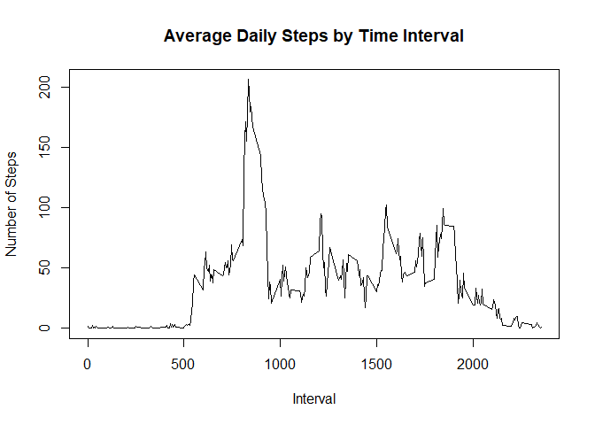
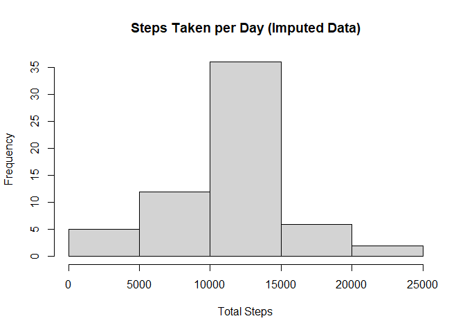
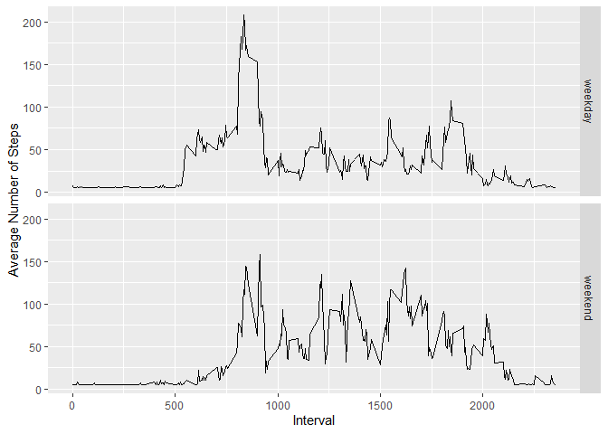

## Loading and preprocessing the data

# Unzip and read file

```r
if(!file.exists('activity.csv')){
  unzip('activity.zip')
}
activity <- read.csv('activity.csv')
```

# Load necessary packages

```r
library(Hmisc)
```

```
## Warning: package 'Hmisc' was built under R version 4.0.5
```

```
## Loading required package: lattice
```

```
## Loading required package: survival
```

```
## Loading required package: Formula
```

```
## Loading required package: ggplot2
```

```
## 
## Attaching package: 'Hmisc'
```

```
## The following objects are masked from 'package:base':
## 
##     format.pval, units
```

```r
library(ggplot2)
library(dplyr)
```

```
## 
## Attaching package: 'dplyr'
```

```
## The following objects are masked from 'package:Hmisc':
## 
##     src, summarize
```

```
## The following objects are masked from 'package:stats':
## 
##     filter, lag
```

```
## The following objects are masked from 'package:base':
## 
##     intersect, setdiff, setequal, union
```


## What is mean total number of steps taken per day?

# Total Steps per Day

```r
steps_by_day <- tapply(activity$steps, activity$date, sum, na.rm=TRUE)
```

# Histogram

```r
hist(steps_by_day, main= 'Steps Taken per Day', xlab='Total Steps', ylab='Frequency')
```

<!-- -->

# Mean and Median Total Steps per Day

```r
mean_steps_by_day <- mean(steps_by_day)
median_steps_by_day <- median(steps_by_day)
```

* Mean: 9354.2295082
* Median:  10395


## What is the average daily activity pattern?

# Interval v. Avg Steps Taken

```r
steps_by_interval <- aggregate(steps ~ interval, activity, mean)
plot(steps_by_interval$interval,steps_by_interval$steps, type="l", xlab="Interval",
     ylab="Number of Steps",main="Average Daily Steps by Time Interval")
```

<!-- -->

# Interval with highest average steps

```r
max_interval <- steps_by_interval[which.max(steps_by_interval$steps),1]
```
* Max Interval: 835


## Imputing missing values

# Total number of missing values

```r
n_missing_values <- length(which(is.na(activity$steps)))
```
Total missing values: 2304

# Replace missing values with average of the interval

```r
activity_full <- activity
activity_full$steps <- impute(activity_full$steps, fun=mean)
```

# Histogram

```r
steps_by_day_full <- tapply(activity_full$steps, activity_full$date, sum, na.rm=TRUE)
hist(steps_by_day_full, main= 'Steps Taken per Day (Imputed Data)', xlab='Total Steps', ylab='Frequency')
```

<!-- -->
# Mean and Median Total Steps per Day

```r
mean_steps_by_day_full <- mean(steps_by_day_full)
median_steps_by_day_full <- median(steps_by_day_full)
```
* Mean (Imputed): 1.0766189\times 10^{4}
* Median (Imputed):  1.0766189\times 10^{4}


# Difference in Mean and Median from initial data

```r
diff_in_mean <- mean_steps_by_day_full - mean_steps_by_day
diff_in_median <- median_steps_by_day_full - median_steps_by_day
```
* Difference in Mean: 1411.959171
* Difference in Median: 371.1886792


## Are there differences in activity patterns between weekdays and weekends?

# Create Weekday variable

```r
activity_full$date <- as.Date(activity_full$date, format = "%Y-%m-%d")
activity_full$weekday <- weekdays(activity_full$date)
activity_full$day_type <- ifelse(activity_full$weekday=='Saturday'|
                                  activity_full$weekday =='Sunday','weekend','weekday')
```

# Plot Avg Steps Weekend v Weekday

```r
steps_by_daytype <- aggregate(steps ~ interval + day_type, data=activity_full, mean)
ggplot(steps_by_daytype, aes(interval, steps)) + 
    geom_line() + 
    facet_grid(day_type ~ .) +
    xlab('Interval') + 
    ylab('Average Number of Steps')
```

<!-- -->
